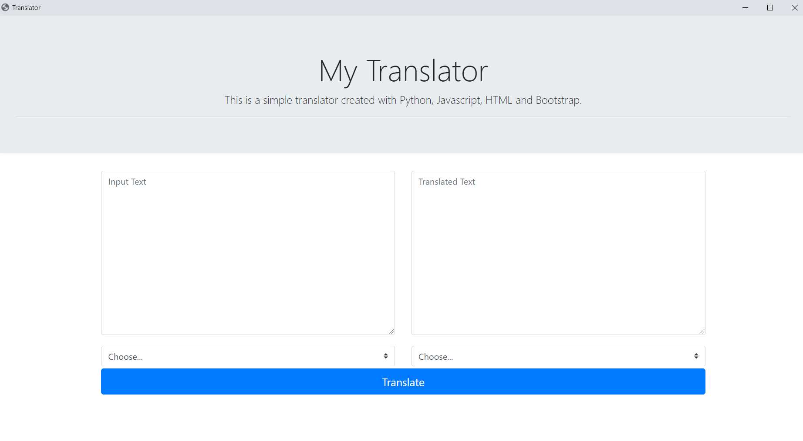

# Python Translator
> This is an app that can translate six languages and it is created with python and bootstrap.

## Screenshot

## Technologies
* OS - Windows 10
* IDE - Microsoft VS Code
* Python - version 3.8.4
* Bootstrap - version 4.5.0
* Eel - version 0.13.2
* Googletrans - version 3.0.0

## Setup
To install / setup on your local environement
* Clone the repository and open in your text editor
* Create a virtual environment in the terminal using:
`virtualenv env
`
* Install the dependencies using:
`pip install -r requirements.txt
`
* Run the app using:
`python backend.py
`
## Contact
Created by [@Timmy-id](https://www.github.com/) - feel free to contact me!

### Languages
Current version supports six languages:
English, French, Hausa, Igbo, Spanish, Yoruba
